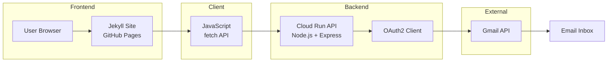

# 🌟 Paul Yashouh — Portfolio Website

[](https://payamaya.github.io/)
[]()
[]()
[](./LICENSE)

---

## 📌 Overview

This repository contains my **personal portfolio website**, built with a static-first architecture and enhanced with a **serverless backend for real-world functionality**.

It showcases:

- Projects
- Skills
- Experience
- A fully functional **contact system** (custom-built, not third-party)

---

## 🧠 Architecture

```text
Frontend (Jekyll + GitHub Pages)
        ↓
JavaScript (fetch API)
        ↓
Backend API (Cloud Run)
        ↓
Gmail API (OAuth2)
        ↓
Email delivered
```



### 🔄 Flow Explanation

1. The user visits the portfolio hosted on GitHub Pages
2. The contact form triggers a JavaScript `fetch()` request
3. The request is sent to a serverless API on Google Cloud Run
4. The backend authenticates using OAuth2
5. Gmail API sends the email to the inbox
6. A response is returned to the frontend

---

## 🛠 Tech Stack

### Frontend

- Jekyll
- HTML5 + CSS3
- JavaScript (Vanilla)
- Liquid Templates

### Hosting & CI/CD

- GitHub Pages
- GitHub Actions

### Backend Integration

- Serverless API hosted on Google Cloud Run

---

## ✨ Key Features

- ⚡ Static, fast-loading website
- 📊 Data-driven content via `_data/*.yml`
- 🧩 Modular layouts and reusable components
- 📬 Custom contact form (no third-party services)
- 🚀 Fully automated deployment pipeline

---

## 📧 Contact Form (Custom Backend)

Unlike typical static sites, this project includes a **custom-built contact system**.

### 🔄 How it works

1. User submits form
2. JavaScript intercepts submission
3. Sends POST request via `fetch()`
4. Backend API processes request
5. Email sent via Gmail API

---

## 🚀 Deployment (CI/CD)

This project uses automated deployment via GitHub Actions.

### 📂 Workflow file

.github/workflows/jekyll.yml

### 🔄 Pipeline

On every push to `main`:

1. Install Ruby & dependencies
2. Build Jekyll site
3. Generate `_site` folder
4. Deploy to GitHub Pages

### ✅ Result

Live site is automatically updated:

👉 https://payamaya.github.io/

---

## 📁 Project Structure

```text
.
├── _layouts/        # Page templates
├── _includes/       # Reusable components
├── _data/           # YAML data files
├── assets/          # CSS, JS, images
├── pages/           # Markdown pages
├── _config.yml      # Jekyll config
└── .github/workflows/jekyll.yml
```

---

## 🧪 Local Development

### Prerequisites

- Ruby (2.7+ or 3.x)
- Bundler

### Run locally

```bash
bundle install
bundle exec jekyll serve --livereload
```

Open:

```
http://127.0.0.1:4000
```

---

## 📌 Why This Architecture?

### ❌ Problem

Static sites cannot:

- Handle form submissions
- Send emails
- Secure credentials

### ✅ Solution

- Keep frontend static (fast, simple)
- Add serverless backend for dynamic features

---

## 🔮 Future Improvements

- Add reCAPTCHA (spam protection)
- Store messages in database
- Admin dashboard for messages
- Email templates (HTML styled)

---

## 📄 License

MIT License
