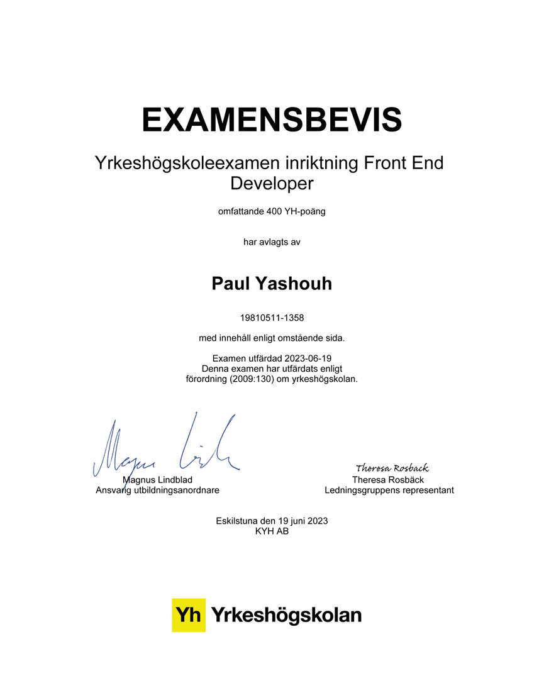

# 👋 Hi, I'm Paul Yashouh!

I am a passionate and dedicated Frontend Developer with a **two-year degree in Frontend Development from KYH**, complemented by a strong understanding of fullstack principles from additional studies at Lexicon IT Proffs and Luleå University of Technology. I thrive on crafting intuitive, responsive, and high-quality user interfaces that deliver exceptional user experiences.

My journey in web development is driven by a desire to innovate, solve complex problems, and continuously learn new technologies. I am adept at translating design concepts into clean, maintainable, and performant code.

---

## 🛠️ My Skills

Here's a summary of my key technical competencies:

### Frontend Technologies
* **Languages:** JavaScript (ES6+), TypeScript, HTML5, CSS3
* **Frameworks/Libraries:** React (including React Hooks), Next.js
* **Styling:** Tailwind CSS, Bootstrap 5, Styled Components (if you use them, otherwise omit)
* **State Management:** (Mention if you have specific experience, e.g., React Query, Zustand - as Krea uses them)
* **Build Tools:** Webpack, Vite (if familiar)
* **UI/UX:** Figma (for design implementation), Responsive Web Design, Mobile-First Design, Accessibility (A11y)

### Fullstack & Backend Familiarity
* **Backend Languages:** C#, Java, PHP, Python (basic familiarity, especially with Django concepts)
* **Frameworks:** .NET (ASP.NET Core Web API), (Spring Boot for Java, if applicable)
* **API:** REST, GraphQL (familiarity)
* **Databases:** SQL Server, MySQL
* **Version Control:** Git, GitHub

### Other Competencies
* **Development Practices:** Agile Methodologies, Clean Code, Code Review
* **Testing:** Unit Testing, Integration Testing
* **Deployment:** Vercel, GitHub Pages
* **Soft Skills:** Great Communicator, Team Player, Problem-Solver, Proactive Learner, Adaptable

---

## 🚀 My Projects & Experience

### Professional Experience

**Frontend Developer Intern @ Stockholm Webbyrå AB**
*(Remote Position)*
During my internship, I gained hands-on experience applying my knowledge in JavaScript, PHP, and WordPress. I honed my skills in Figma for design implementation and collaborated effectively in a virtual environment. This role provided valuable insights into professional web development workflows and strengthened my teamwork abilities. I hold excellent references from this position.

### Personal Projects

**1. Snickeri och Restaurang Hemsida (Carpentry and Restaurant Website)**
* **Technologies:** Next.js, Tailwind CSS
* **Description:** I developed a comprehensive, full-stack website for a carpentry business and a restaurant. This project involved taking full responsibility for both coding and design, from initial concept to deployment.
* **Key Learnings/Achievements:** Enhanced my skills in SEO optimization, mobile-first design, and creating fully responsive web experiences. Showcased strong design implementation and independent project management.
* **(Optional: Link to Live Demo or GitHub Repo if available)**

**(Add more projects here if you have them! Even small ones that show specific skills.)**

---

## 🎯 What's Next?

I am eager to apply my diverse skill set and passion for frontend development in a dynamic and innovative environment. I am always seeking new challenges and opportunities to learn and grow alongside a supportive team.

Thank you for visiting my portfolio!

---

**[Optional: Add a professional photo here, in `/assets/images/mypic1.jpg`]**
**[Optional: Add a professional photo here, in `assets/images/examens-bild.png`]**
*Example: ``*
*Example: ``*
